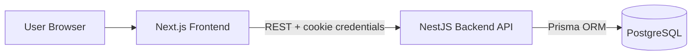

# Employee Attendance System

A full-stack attendance management platform with secure authentication, role-based access control, leave workflow, shift management, reporting, and a modern responsive UI.

This project is suitable as a university capstone/demo because it includes:
- Real-world domain modeling (users, employees, shifts, attendance, leaves)
- End-to-end architecture (frontend + backend + database)
- Security-focused auth (HTTP-only cookie JWT + RBAC)
- Production-style UX (responsive app shell, charts, pagination, polished login/landing pages)

---

## 1) Tech Stack

### Frontend
- **Next.js 16** (App Router)
- **React 19**
- **TypeScript**
- **Tailwind CSS v4**
- **shadcn/base-ui components**
- **Redux Toolkit Query**
- **Framer Motion** (page transitions)
- **Recharts** (dashboard/report charts)

### Backend
- **NestJS 11**
- **Prisma ORM**
- **PostgreSQL**
- **class-validator / class-transformer**
- **Passport JWT + cookie-parser**

### DevOps / Runtime
- Dockerized backend build
- Prisma migration on container startup (`entrypoint.sh`)

---

## 2) Core Features

### Authentication & Security
- Login/logout with JWT stored in **HTTP-only cookie**
- Session validation endpoint (`/auth/me`)
- Role-based guards (`ADMIN`, `MANAGER`, `EMPLOYEE`)

### Employee & Shift Management
- Employee creation/list/update/deactivate (admin scope)
- Shift creation/list/update/delete (admin scope)

### Attendance
- Employee check-in/check-out flow
- Attendance status tracking (present, late, half-day, absent, on-leave, holiday)
- Role-aware attendance list views

### Leave Workflow
- Employee leave request submission
- Admin/Manager review actions (approve/reject)
- Leave history and review dashboard tables

### Reports
- Today KPIs (employees/present/pending leave)
- Monthly attendance summary
- Chart visualization on dashboard/report pages

### UI/UX
- Modern responsive sidebar + topbar layout
- Mobile navigation drawer
- Pagination on major tables
- Dedicated landing page with CTA
- Production-grade login form UX

---

## 3) Project Structure

```text
employee-attendance/
├─ backend/                  # NestJS API + Prisma
│  ├─ src/                   # modules (auth, users, employees, shifts, attendance, leave, reports)
│  ├─ prisma/                # schema, migrations, seed
│  ├─ Dockerfile
│  └─ compose.yml
├─ frontend/                 # Next.js app
│  ├─ src/app/               # app routes/layouts/pages
│  ├─ src/store/             # RTK Query API slices
│  ├─ src/components/        # UI + charts
│  └─ public/
└─ README.md
```

---

## 4) Architecture Overview



---

## 5) Local Development Setup

## Prerequisites
- Node.js 20+ (recommended latest LTS)
- npm
- PostgreSQL (local or remote)

### A) Backend setup

```bash
cd backend
npm install
```

1. Configure environment in `backend/.env` (especially `DATABASE_URL`)
2. Run database migrations:

```bash
npx prisma migrate dev
```

3. Seed sample data:

```bash
npm run db:seed
```

4. Start backend:

```bash
npm run start:dev
```

Backend default: `http://localhost:3001`

### B) Frontend setup

```bash
cd frontend
npm install
npm run dev
```

Frontend default: `http://localhost:3000`

---

## 6) Seed Data (Demo Accounts)

The seed creates a realistic dataset:
- 3 admins
- 3 managers
- 30 employees
- Attendance + leave records for recent days

### Fixed sample logins
- **Admins**: `azad@gmail.com`, `rakib@gmail.com`, `aduri@gmail.com`
- **Managers**: `azad1@gmail.com`, `rakib1@gmail.com`, `aduri1@gmail.com`
- **Employees**: `e1@gmail.com` ... `e30@gmail.com`
- **Password (all users)**: `Asdf@123`

> Note: `backend/.env` also contains `SEED_ADMIN_*` vars for legacy/simple seeding scenarios.

---

## 7) API Modules & Main Endpoints

| Module | Endpoints (examples) |
|---|---|
| Auth | `POST /auth/login`, `POST /auth/logout`, `GET /auth/me` |
| Users | `GET /users/me`, `GET /users` |
| Employees | `POST /employees`, `GET /employees`, `PATCH /employees/:id` |
| Shifts | `POST /shifts`, `GET /shifts`, `PATCH /shifts/:id` |
| Attendance | `POST /attendance/check-in`, `POST /attendance/check-out`, `GET /attendance` |
| Leave | `POST /leave`, `GET /leave/mine`, `GET /leave`, `PATCH /leave/:id/review` |
| Reports | `GET /reports/today`, `GET /reports/monthly` |

---

## 8) Scripts Reference

### Backend (`backend/package.json`)
- `npm run start:dev` — start NestJS in watch mode
- `npm run build` — production build
- `npm run db:seed` — run TypeScript seed script
- `npm run test` — run unit tests

### Frontend (`frontend/package.json`)
- `npm run dev` — run Next.js dev server
- `npm run build` — production build
- `npm run start` — run production server

---

## 9) VPS Docker Deployment (Backend Only)

This project supports a backend-only container on VPS with an external PostgreSQL URL from `backend/.env`.

### A) Prerequisites (VPS)
- Docker + Docker Compose plugin installed
- `backend/.env` present on server with valid `DATABASE_URL`
- Port `3001` open in firewall/reverse proxy

### B) Deploy commands

```bash
cd backend
docker compose build backend
docker compose up -d backend
```

### C) Operations

```bash
# container status
docker compose ps

# logs
docker compose logs -f backend

# restart after env/image changes
docker compose up -d --build backend
```

### D) Startup behavior
- Container runs `prisma migrate deploy` on each startup (safe/idempotent)
- Container does **not** run seed automatically
- App serves on `3001` inside and outside container mapping

---

## 10) SEO & Sharing

Frontend metadata includes:
- Open Graph title/description
- Twitter card metadata
- Share image reference (`/og.png`)

For best social preview, place a 1200x630 image at:
- `frontend/public/og.png`

---

## 11) Troubleshooting

### Seed fails with “Database does not exist”
- Ensure target DB exists in your PostgreSQL server.
- Verify `DATABASE_URL` in `backend/.env`.

### Login works but dashboard requests fail
- Confirm frontend base URL is correct in `frontend/.env` or `.env.local`:
  - `NEXT_PUBLIC_API_BASE_URL`
- Ensure backend CORS origin matches frontend origin.

### Docker cannot connect to database
- For VPS backend-only deployment, set `DATABASE_URL` to your real DB host (not `localhost` unless DB is on same container host/network namespace).
- Confirm DB user/password/port and network/firewall access from VPS.

### Prisma migration fails at container startup
- Ensure migration files exist under `backend/prisma/migrations`.
- Check `docker compose logs -f backend` for Prisma errors.
- Validate `DATABASE_URL` points to a reachable PostgreSQL instance.

---

## 12) Academic Submission Tips

To maximize grading impact, include:
- System architecture diagram
- ER diagram from Prisma models
- API testing evidence (Postman screenshots)
- UI screenshots (desktop + mobile)
- Role-based flow demos (Admin, Manager, Employee)

This repository already demonstrates production-minded implementation quality and complete feature coverage for an attendance management domain.

---

## 13) Academic Documentation

- Main project report: `docs/REPORT.md`
- SRS: `docs/Employee_Attendance_SRS.md`
- Diagram notes: `docs/DIAGRAMS.md`
- Submission checklist: `docs/SUBMISSION_CHECKLIST.md`