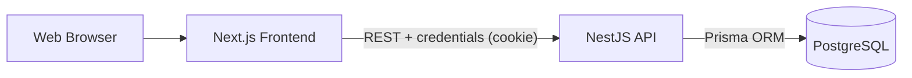

# Employee Attendance System  
## Academic Project Report

**Project Title:** Employee Attendance System  
**Project Type:** Full-Stack Web Application  
**Team/Author:** _[Add your name]_  
**Supervisor/Course:** _[Add course details]_  
**Submission Date:** _[Add date]_

---

## 1. Abstract

The Employee Attendance System is a role-based web platform that digitizes daily attendance operations, leave workflows, shift assignment, and reporting.  
It is designed for three user roles: **Admin**, **Manager**, and **Employee**.  
The system uses a modern full-stack architecture with **Next.js** frontend, **NestJS** backend, and **PostgreSQL** database using **Prisma ORM**.

Key outcomes:
- Reliable attendance and leave lifecycle management
- Role-based secured access with cookie-based JWT authentication
- Responsive UI for desktop and mobile
- Analytics-ready reporting views and charts

---

## 2. Problem Statement

Many institutions and small-to-medium organizations still rely on manual attendance and leave management (paper sheets, spreadsheets, messaging apps).  
This creates:
- Data inconsistency and loss risk
- Slow approval workflows
- Limited transparency for employees and managers
- Lack of reliable reporting for decision making

This project solves these problems by providing a centralized, secure, and user-friendly attendance management platform.

---

## 3. Objectives

1. Build a secure authentication system with role-based authorization.
2. Implement attendance check-in/check-out and status tracking.
3. Implement leave request and review workflow.
4. Manage employees and shifts with admin controls.
5. Provide operational reports and visual summaries.
6. Ensure responsive UI/UX and production-oriented structure.

---

## 4. Scope

### In Scope
- Authentication (login, logout, session validation)
- Employee management (admin)
- Shift management (admin)
- Attendance records and status tracking
- Leave request/review
- KPI and monthly reports
- Seeded demo data for testing/presentation

### Out of Scope (Future Work)
- Biometric integration
- Email/SMS notifications
- Multi-tenant organization support
- Payroll integration

---

## 5. System Architecture

### Architectural Notes
- Frontend handles user experience, routing, and API integration via RTK Query.
- Backend handles validation, business logic, RBAC, and persistence.
- Database schema is normalized with relations between users, employees, shifts, attendance, and leave.

---

## 6. Technology Stack

### Frontend
- Next.js 16, React 19, TypeScript
- Tailwind CSS v4 + shadcn/base-ui
- Redux Toolkit Query
- Framer Motion, Recharts

### Backend
- NestJS 11
- Prisma ORM
- class-validator / class-transformer
- Passport JWT + cookie-parser

### Database
- PostgreSQL

### DevOps
- Dockerized backend runtime
- Startup migrations via entrypoint script

---

## 7. Functional Requirements (Implemented)

### 7.1 Authentication
- User login with email/password
- Secure cookie token issuance
- Session check endpoint
- Logout endpoint

### 7.2 Role-Based Access
- Admin-only resources for employee/shift management
- Manager review permissions for leave/reports
- Employee self-service access for attendance and leave requests

### 7.3 Attendance
- Check-in/check-out endpoints
- Daily attendance record listing
- Status model: PRESENT, LATE, HALF_DAY, ABSENT, ON_LEAVE, HOLIDAY

### 7.4 Leave Management
- Employee leave request submission
- Admin/Manager approval/rejection review
- Leave list for personal and administrative views

### 7.5 Reporting
- Today KPI summary
- Monthly attendance summary
- Chart-based visualization on dashboard/reports pages

---

## 8. Non-Functional Requirements

- **Usability:** Clean and intuitive UI with responsive behavior.
- **Security:** HTTP-only cookies, JWT auth, role guards.
- **Performance:** Server/client pagination on major lists.
- **Maintainability:** Modular backend architecture and typed frontend APIs.
- **Scalability readiness:** Clear separation of concerns and ORM abstraction.

---

## 9. Database Design Summary

Core entities:
- `User` (role, credentials, status)
- `Employee` (profile, department, shift assignment)
- `Shift` (timing, working days, grace period)
- `AttendanceRecord` (date, check-in/out, status)
- `LeaveRequest` (type, range, status, reviewer)

Refer to:
- `backend/prisma/schema.prisma`
- Existing class/use-case diagrams in `docs/`

---

## 10. UI/UX Implementation Highlights

- Modern app shell with sidebar + topbar
- Mobile drawer navigation
- Landing page with clear CTA to login
- Production-grade login experience (validation, show/hide password)
- Pagination for Employees, Attendance, Leave
- Themed chart and card system for reports

---

## 11. Testing & Validation

### Manual Validation Completed
- Login/logout/session flow
- Role-based route and action visibility
- Attendance check-in/check-out
- Leave request/review behavior
- Reports and charts rendering
- Mobile responsiveness checks

### Build Validation
- Frontend `npm run build`: passed
- Backend build/tests available via package scripts

---

## 12. Deployment Notes

- Backend supports containerized deployment with migration step in `entrypoint.sh`.
- Frontend can be deployed as a Next.js application.
- Environment variables required for API URL, DB, JWT secret, and cookie behavior.

---

## 13. Demo Accounts (Seed Data)

- Admin: `azad@gmail.com`, `rakib@gmail.com`, `aduri@gmail.com`
- Manager: `azad1@gmail.com`, `rakib1@gmail.com`, `aduri1@gmail.com`
- Employees: `e1@gmail.com` ... `e30@gmail.com`
- Password (all): `Asdf@123`

---

## 14. Challenges & Solutions

1. **Role mismatch between backend permissions and frontend visibility**  
   Fixed by aligning manager report/leave access in UI.

2. **Chart colors rendering black**  
   Resolved by mapping chart colors directly to CSS variable values.

3. **Large-table usability**  
   Improved with pagination and cleaner responsive table patterns.

4. **Mobile navigation clarity**  
   Added dedicated topbar + mobile drawer flow.

---

## 15. Future Improvements

- Server-side pagination for all heavy list endpoints
- Notification system (email/in-app)
- Audit log and activity timeline
- Export reports (CSV/PDF)
- Stronger analytics dashboard (trends and comparisons)

---

## 16. Conclusion

This project successfully demonstrates a complete attendance management system using modern web engineering practices.  
It solves practical organizational problems with secure architecture, clear business workflows, responsive UI, and maintainable code structure.  
The implementation is suitable for academic evaluation and can be extended for real production environments.

---

## 17. Viva / Demo Script (Short)

1. Open landing page (`/`) and show CTA flow.
2. Login as Admin and show:
   - Dashboard KPIs
   - Employee and shift modules
3. Login as Employee and show:
   - Check-in/check-out
   - Leave request
   - Monthly summary chart
4. Login as Manager and show:
   - Leave review
   - Reports access
5. Show responsive layout in mobile viewport.
6. Explain architecture and security model in 1 minute.

